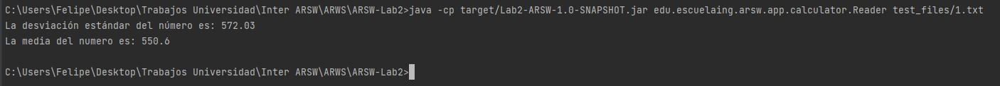
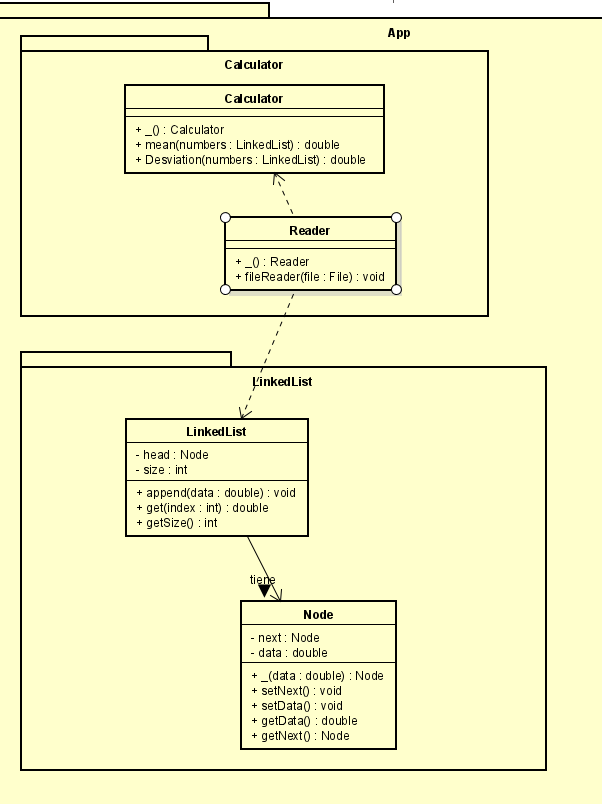
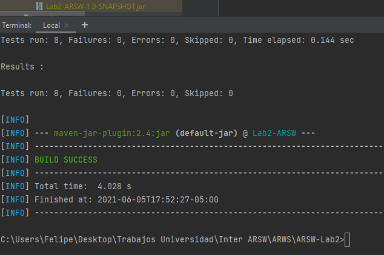
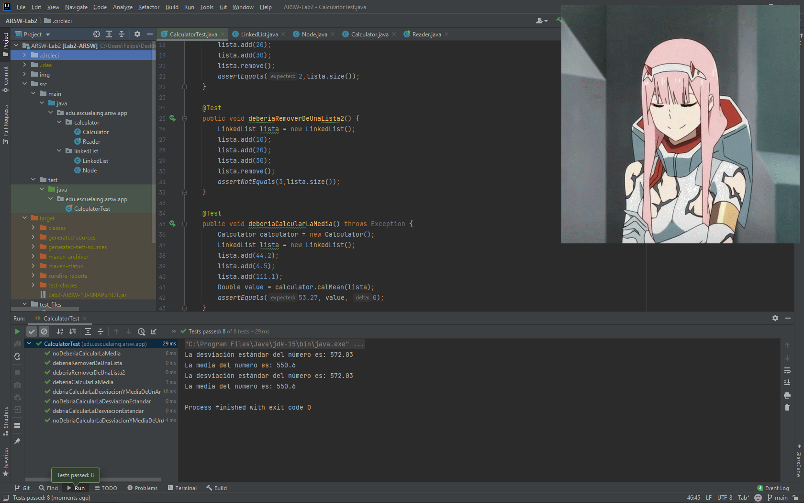

# Lab2 ARSW-OODesign

El programa mostrado a continuación implementa una calculadora que utiliza un linked list con una implementación propia. La calculadora  calculará la media y la desviación estándar de los numero que se le otorguen

## Instrucciones de uso

Para poder usar el proyecto lo primero que debe realizar es clonar este repositorio utilizando el siguiente comando desde la terminal del SO que este utilizando:

```
git clone https://github.com/PhillipMarin117/ARSW-Lab2
```
Luego debe redirigirse por medio de la terminal al directorio raíz la cual contiene el achivo pom.xml.

Una vez se encuentre en este directorio se debe compilar el programa para esto se debe ejecutar el siguiente comando:

```
mvn package
```

Para finalizar y ejecutar el programa debe utilizar el siguiente comando:

```
java -cp target/Lab2-ARSW-1.0-SNAPSHOT.jar edu.escuelaing.arsw.app.calculator.Reader test_files/1.txt"
```

Como podrán ver a continuación se realiza dicho ejercicio, el cual nos retornara tanto su media como su desviación estándar  



En la carpeta test_files se encuentran dos archivos para su posible lectura de la misma forma en que se explico en la parte superior 


### Prerrequisitos

Para ejecutar con éxito este programa se requiere de los siguientes programas instalados en su máquina. Se recomienda tener las versiones actualizadas, pero si no al menos con las versiones básicas funcionales.
Para lograr  conocer si tiene instalados los programas y de paso la versión, ejecute los siguientes comandos
```
java -vesion
git --vesion
mvn -version
```
Le debería aparecer de la siguiente manera 
```
java versionjava version: "1.8.0_171"
git version: 2.19.1.windows.1
Apache Maven version: 3.6.3
```

## Diagrama de clases




## Pruebas del programa

Al ejecutar el comando mvn package  se compila el programa y ejecuta las pruebas al mismo tiempo.



Estas pruebas pruebas la funcionalidad correcta del programa, validando que cargué correctamente los archivos y sus cálculos sean los correctos. Tanto de su desviación estándar como de su media. 

Acá podemos observar como ejecuta de manera correcta los test


Dentro de la imagen anterior podemos evidenciar algunas clases de prueba que se implementaron

## Construido con


* [Maven](https://maven.apache.org/) - Dependency Management
* [Java](https://www.java.com/es/download/)
* [Git](https://github.com/) - Versionamiento


## Authors

* **Felipe Marín** - *LOCS/Hora  367/14 = 26 LOCS/Hora* - Fecha: 05/06/2021


## License

This project is licensed under the MIT License - see the [LICENSE.md](LICENSE.md) file for details